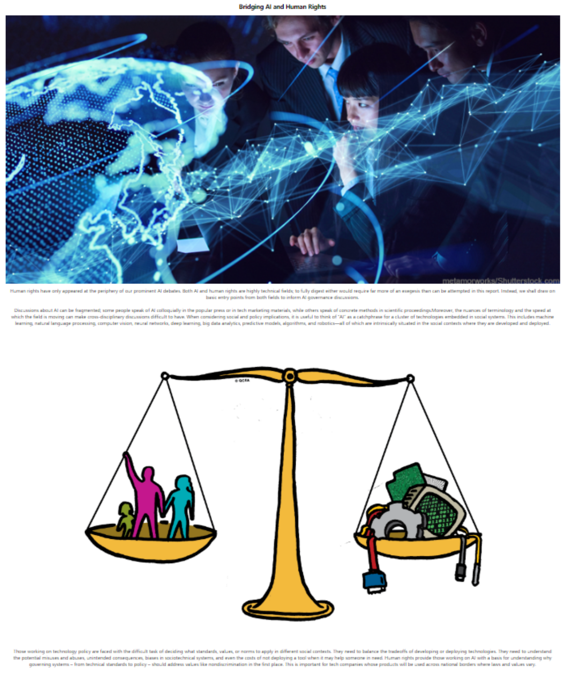

# Governing Artificial Intelligence
# 
# Wireframe
### Nav Map

### Introduction

### Bridging Human Rights

### Stakeholders

### Slide

### Footer

# 
# Technologies used
### react-scroll-into-view
### react-medium-image-zoom
### react-slick
# 
# User engagement elements
### Nav Map button animations (and blue up arrow) and Brain background
### Gifs: Brain background in Nav Map (in App.js). Brain circuit in Introduction component
# 
# Division of work
### Sione: Introduction component, BridgingRights component, Github owner
### Kim: Nav Map (in App.js), Stakeholders component
### Daniel: Slide component, Footer component
### Aparna: Wireframe, HumanRight component
